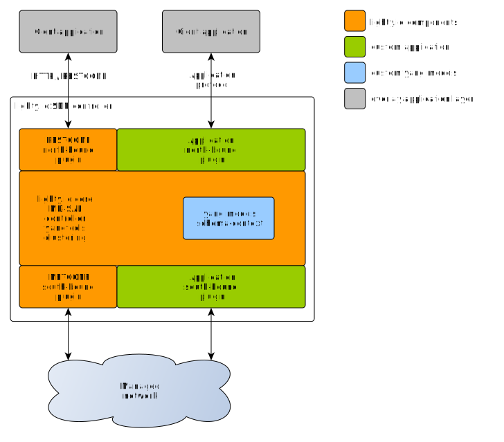
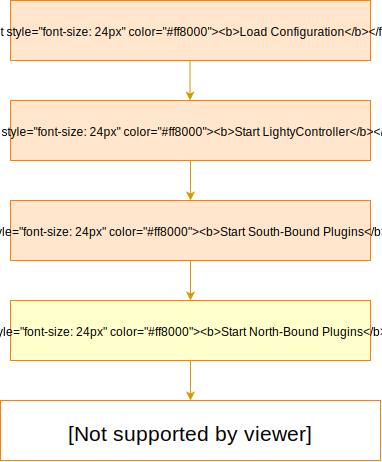

# lighty.io 18
__lighty.io__ is a Software Development Kit powered by [OpenDaylight](https://www.opendaylight.org/) to support, ease & accelerate the development of
Software-Defined Networking (SDN) solutions in Java. Developed by [PANTHEON.tech](https://pantheon.tech).

It utilizes core [OpenDaylight](https://www.opendaylight.org/) components, which are available as a set of libraries and are adapted to run in a __plain Java SE environment__.

[](https://github.com/PANTHEONtech/lighty/actions)
[](https://maven-badges.herokuapp.com/maven-central/io.lighty.core/lighty-bom)
[](https://opensource.org/licenses/EPL-1.0)

_This branch maintains compatibility with __OpenDaylight Argon,__ release._

## Features
- [x] __Removed Karaf__: Having Java SE as a runtime, you can use a framework of your choice, not only Karaf
- [x] __Improved Speed__: Improved memory management & speed
- [x] __Modularity__: Your application code can start, stop & restart modules, as required

## Use Cases

- [OpenDaylight to lighty.io Migration](docs/ODL-migration-guide.md)
- [BGP Route Reflector](https://pantheon.tech/lighty-io-bgp-route-reflector/)
- [Migration of ONAP SDNC to lighty.io](https://lighty.io/migration-of-onap-sdnc-to-lighty-io/)
- [NETCONF Device on ARM](https://lighty.io/lighty-io-netconf-device-on-arm/)
- [BGP EVPN Route-Reflector](https://pantheon.tech/lightyio-bgp-evpn-rr/)
- [Migration of OpenDaylight TransportPCE to lighty.io](https://lighty.io/migration-of-odl-transportpce-to-lighty-io/)
- [Rapid NETCONF Controller Integration Testing](https://lighty.io/netconf-performance-test/)

## Modules, Examples & Apps
| Modules | Examples | Applications |
| :---: | :---: | :---:|
| [AAA Integration Tests](/lighty-modules/integration-tests-aaa/) | [NETCONF/RESTCONF App](/lighty-examples/lighty-community-restconf-netconf-app) | [RESTCONF-NETCONF Application](/lighty-applications/lighty-rnc-app-aggregator/) | 
| [Integration Tests](/lighty-modules/integration-tests/) | [gNMI/RESTCONF App](/lighty-examples/lighty-gnmi-community-restconf-app) | [gNMI RESTCONF Application](/lighty-applications/lighty-rcgnmi-app-aggregator/) | 
| [AAA](/lighty-modules/lighty-aaa/) | [SpringBoot Integration](/lighty-examples/lighty-controller-springboot-netconf) | | 
| [gNMI](/lighty-modules/lighty-gnmi/) | | |
| [Jetty Server](/lighty-modules/lighty-jetty-server/) | | | 
| [NETCONF SouthBound](/lighty-modules/lighty-netconf-sb/) | | | 
| [RESTCONF NouthBound](/lighty-modules/lighty-restconf-nb-community/) | | | 
| [Swagger](/lighty-modules/lighty-swagger/) | | |


## Components
* __lighty-core__ - [OpenDaylight](https://www.opendaylight.org/) [core services](lighty-core/lighty-controller/README.md): MD-SAL, Controller, yangtools, Clustering
  - [google guice extension](lighty-core/lighty-controller-guice-di/README.md) - Dependency injection extension for [Google Guice](https://github.com/google/guice)
  - [spring extension](lighty-core/lighty-controller-spring-di/README.md) - Dependency injection extension for [spring.io](https://spring.io/)  
* __lighty-examples__ - [Examples and applications](lighty-examples/README.md)
* __lighty-models__ - Example [YANG models](lighty-models/README.md) and YANG model artifacts
* __lighty-modules__ - [OpenDaylight](https://www.opendaylight.org/) NorthBound (NB) and SouthBound (SB) plugin initializers
  - [RESTCONF North-Bound plugin](lighty-modules/lighty-restconf-nb-community)
  - [NETCONF South-Bound plugin](lighty-modules/lighty-netconf-sb) 
* __lighty-resources__ - Resource artifacts




## Build & Install
In order to build and install lighty.io artifacts locally, follow the steps below:
1. __Install JDK__ - make sure [JDK 17](https://openjdk.java.net/projects/jdk/17/) is installed
2. __Install maven__ - make sure you have maven 3.8.5 or later installed
3. __Setup maven__ - make sure you have the proper [settings.xml](https://github.com/opendaylight/odlparent/blob/master/settings.xml) in your ```~/.m2``` directory
4. __Build & Install locally__ - by running command: ``mvn clean install -DskipTests``



## Migration from OpenDaylight to lighty.io
[This guide](docs/ODL-migration-guide.md) describes the migration procedure from OpenDaylight/Karaf application to lighty.io.
It contains a summary of practical experiences, based on real-life OpenDaylight project migrations.


## Run JUnit & IT tests
lighty.io project contains JUnit & integration tests. Because a complete OpenDaylight/lighty.io controller is often started with south-bound and north-bound plugins, these tests are often required.
IT tests are comparable with single-feature tests in ODL/Karaf environment - but much faster.

_Before starting IT tests, please make sure that ports 8080, 8888, 8185, 2550 are free on localhost._

To run unit and integration tests, use the command:

```mvn clean install```

## Support & More Information
If you are interested in lighty.io, require technical support, need blogs, FAQ, technical articles and more examples, visit [lighty.io](https://lighty.io/)
