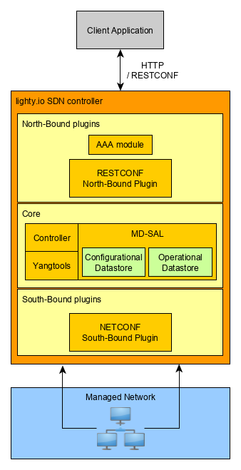

# lighty.io RNC application
The lighty.io RESTCONF-NETCONF application allows to easily initialize, start and utilize the most used OpenDaylight services and optionally add custom business logic.

Most important lighty.io components used are:
- [lighty.io controller](../../lighty-core/lighty-controller)
  provides core ODL services (like MDSAL, yangtools, global schema context,...) that are required
  for other services or plugins.
- [RESTCONF Northbound plugin](../../lighty-modules/lighty-restconf-nb-community)
  provides the RESTCONF interface that is used to communicate with the application using the RESTCONF protocol over the HTTP.
- [NETCONF Southbound plugin](../../lighty-modules/lighty-netconf-sb)
  enables application to connect to the NETCONF devices using the NETCONF protocol and read/write configuration
  from them or execute RPCs.
- [AAA Module](../../lighty-modules/lighty-aaa-aggregator/lighty-aaa) provides authorization,
  authentication and accounting which for example enables to use Basic Authentication for RESTCONF northbound interface.
  This module is optional and can be turned ON/OFF using application configuration.



## Prerequisites
In order to build and start the lighty.io RNC application locally, you need:
* Java 21 or later 
* Maven 3.8.5 or later
* (Optional) Docker for creating and running Docker images

## Build and start
To build and start the lighty.io RNC application in the local environment, follow these steps:

1. Build the application using this maven command:  
   `mvn clean install -pl :lighty-rnc-app -am`

2. Unpack the application ZIP distribution created in the _lighty-rnc-app/target_ called
   `lighty-rnc-app-<version>-bin.zip`
   
3. Start the application by running it's _.jar_ file:  
   `java -jar lighty-rnc-app-<version>.jar`
   
4. To start the application with custom lighty configuration, use arg `-c`:
   `java -jar lighty-rnc-app-<version>.jar -c /path/to/config-file`

   To extend lighty modules time-out use `"modules": { "moduleTimeoutSeconds": SECONDS },` property inside JSON configuration. This property increases the time after which the exception is thrown if the module is not successfully initialized by then (Default 60).
   Example configuration files are located on following folder [example-config](lighty-rnc-app-docker/example-config).

5. If the application was started successfully, then a log similar should be present in the console:  
   `INFO [main] (Main.java:80) - RNC lighty.io application started in 5989.108ms`

6. Test the lighty.io RNC application. The default RESTCONF port is `8888`

7. The default credentials for http requests is login:`admin`, password: `admin`. 
To edit the user's credentials, [idmtool](https://docs.opendaylight.org/projects/aaa/en/stable-aluminium/user-guide.html#idmtool) can be used to:
    - create new `etc` directory and create there `org.ops4j.pax.web.cfg` file
    - add this two lines in the `org.ops4j.pax.web.cfg` file: 
       
       `org.osgi.service.http.port.secure = 8888`
       
       `org.osgi.service.http.secure.enabled = true`
        
        where `8888` - default RESTCONF port. It can be different according to your configuration.
    - download `idmtool.py` script from AAA project github repository and place downloaded file into `etc` directory
        
        `curl -O https://raw.githubusercontent.com/opendaylight/aaa/stable/aluminium/aaa-shiro/impl/src/main/resources/idmtool.py`
    - run script (latest python version must be installed)
    
        `python etc/idmtool.py -h`
        
        This will show you the list of possible commands that can be used.
        If you are using a self-generated SSL sertificate, you should use the `-k` argument.
        For example, to show the list of all users:
      
        `python etc/idmtool.py -k admin list-users`
      
        where `admin` - user name (the default name); `list-users` command to show all users.
        It will ask to write password for `admin` user (the default one is `admin`)    
    
    Also, it is possible to configure user's credentials via [REST](https://docs.opendaylight.org/projects/aaa/en/latest/user-guide.html#configuration-using-the-restful-web-service)

8. For using a SSL connection, the correct certificate must be used.
By default, a test certificate is used (`lighty-rnc-module/src/main/resources/keystore/lightyio.jks`).
For generating a JKS file `keytool` utility can be used. Example of command to regenerate keystore with self-signed certificate:

```
keytool -genkey -alias lightyio -keyalg RSA -keystore lightyio.jks -keysize 2048 -ext san=dns:lighty.io,dns:lightyio,dns:restconf.lighty.io,dns:management.lighty.io,dns:localhost,ip:127.0.0.1,ip:0.0.0.0 -validity 2000
```
which creates new `lightyio.jks` keystore file with hostnames: `lighty.io, lightyio, restconf.lighty.io, management.lighty.io, localhost`

The path to correct certificate can be placed in `configuration.json file` (`restconf.keyStoreFile`)
Also you need to provide file type for this certificate (`restconf.keyStoreType`) and password (`restconf.keyStorePassword`)

## Build & Start w/ Docker
To build and start the lighty.io RNC application using Docker in a local environment, follow these steps:

1. Build the application using this maven command:  
   `mvn clean install -P docker`

2. Start the application using following docker command.   
   `docker run -it --name lighty-rnc --network host --rm lighty-rnc`

3. To start the application with a custom lighty configuration( -c ) and custom initial log4j config file( -l ), use the command:
  ```
   docker run -it --name lighty-rnc --network host
   -v /absolute_path/to/config-file/configuration.json:/lighty-rnc/configuration.json 
   -v /absolute_path/to/config-file/logger.properties:/lighty-rnc/logger.properties 
   --rm lighty-rnc -c configuration.json -l logger.properties
  ```

   If your configuration.json file specifies a path to the initial configuration data to load on startup
   (for more information, check 
   [lighty-controller](../../lighty-core/lighty-controller))
   you need to mount the JSON/XML file as well:
   `-v /absolute/path/to/file/initData.xml:/lighty-rnc/initData.xml`
   , then your path to this file in configuration.json becomes just "./initData.xml":
   ``` 
    "initialConfigData": {
          "pathToInitDataFile": "./initData.xml",
          "format": "xml"
    }
   ```
   Example configuration files are located here:  
   `lighty-rnc-app-docker/example-config/*`

4. If the application was started successfully, then a similar log should be present in the console:  
   `INFO [main] (Main.java:81) - RNC lighty.io application started in 5989.108ms`

5. Test the lighty.io RNC application. Default RESTCONF port is `8888`

## Example Postman collection
For convenience, we provide [postman-collection](lighty-rnc-app/Lighty-RNC.postman_collection.json) which contains
 example http requests (RESTCONF and Akka) for communicating with Lighty RNC application.  
_Note: IP addresses and port numbers may differ depending on deployment._
## Deployment via helm chart
### Prerequisites
* Kubernetes cluster 1.22.4 (minikube / microk8s /..)
* helm 3.7.1
### Deploy
To easily deploy the lighty.io RNC application to Kubernetes, we provide a custom helm chart located in /lighty-rnc-app-helm/helm/.
To install, make sure that the Docker image is defined in `values.yaml` and accessible, then run command:
`microk8s helm3 install lighty-rnc-app ./lighty-rnc-app-helm/`
in the `/lighty-rnc-app-helm/helm/` directory.
### Providing startup configuration
By default, the deployed application is started with a custom configuration.json 
(for more information check the [lighty-controller](../../lighty-core/lighty-controller)).
We supply this configuration file by passing a Kubernetes configmap (`configmaps.yaml`), which you can modify to your needs.
To use the functionality of loading configuration data on startup, add new entry to configmaps.yaml:
`initData: |
     your initial yang modeled json/xml data
`
Then add:
` "initialConfigData": {
       "pathToInitDataFile": "{{ .Values.lighty.configDirectoryName }}/initData",
       "format": "xml"/"json" depending on format
      }` 
entry to controller json node in lighty-config.json in `configmaps.yaml`.
If everything was set up corectly, then your data will be loaded to controller on startup and appropriate listeners should be triggered.
For example, if your initial json data contains node in netconf topology: 
 ```
{
  "network-topology:network-topology": {
    "topology": [
      {
        "topology-id": "topology-netconf",
        "node": [
          {
            "node-id": "device1",
            "netconf-node-topology:schemaless": false,
            "netconf-node-topology:port": <device-port>,
            "netconf-node-topology:tcp-only": false,
            "netconf-node-topology:username": "admin",
            "netconf-node-topology:password": "admin",
            "netconf-node-topology:host": "<device-ip>",
            "netconf-node-topology:keepalive-delay": 0
          }
        ]
      }
    ]
  }
}
```
and the device is running, the connection should be established upon startup.
For testing purposes, you can use [lighty-netconf-simulator](https://github.com/PANTHEONtech/lighty-netconf-simulator)
as a netconf device.

## Setup Logging
Default logging configuration may be overwritten by JVM option
```-Dlog4j.configurationFile=path/to/log4j2.xml```

Content of ```log4j2.xml``` is described [here](https://logging.apache.org/log4j/2.x/manual/configuration.html).


## Update logger with JMX
Java Management Extensions is a tool enabled by default which makes it easy to change runtime
configuration of the application. Among other options, we use [log4j2](https://logging.apache.org/log4j/2.0/manual/jmx.html)
which has build in option to change logging behaviour during runtime via JMX client which can be connected to running lighty instance.
1. Start the application (see previous sections)
2. Connect the JXM client
  We recommend using `jconsole` because it is part of the standard Java JRE.  
  The command for connecting jconsole to JMX server is:  
    `jconsole <ip-of-running-lighty>:<JMX-port>`, the default JMX-port is 1099.
      
This approach works only if the application is running locally.  
  
If you want to connect the JMX client to the application running remotely or containerized (k8s deployment or/and docker),
you need to start the application using the following JAVA_OPTS:
```
JAVA_OPTS = -Dcom.sun.management.jmxremote
             -Dcom.sun.management.jmxremote.authenticate=false
             -Dcom.sun.management.jmxremote.ssl=false
             -Dcom.sun.management.jmxremote.local.only=false
             -Dcom.sun.management.jmxremote.port=<JMX_PORT>
             -Dcom.sun.management.jmxremote.rmi.port=<JMX_PORT>
             -Djava.rmi.server.hostname=127.0.0.1
```
Then run `java $JAVA_OPTS -jar lighty-rnc-app-<version> ...`

If you want to completely disable logger JMX option run application with following JAVA_OPTS
`java -Dlog4j2.disable.jmx=true -jar lighty-rnc-app-<version> ...`

### Connecting JMX client to application running in docker
1. If we want to be able to connect the JMX, we need to start the app with JAVA_OPTS, as described in the
 previous chapter.
 In Docker, the most convenient way to do this is to create env.file and run the docker run with `--env-file env.file` argument
 The env.file must contain the definition of the described JAVA_OPTS environment variable.
 We also need to publish the container JMX_PORT to host, this is done via `-p <JMX_PORT>:<JMX_PORT>` argument.
 So the docker run command becomes:  
  `docker run -it --name lighty-rnc --env-file env.file -p <JMX_PORT>:<JMX_PORT> ...`
 The rest of the command stays the same as explained in previous chapters.
 2. Connect the JMX client via the command `jconsole <ip-of-container>:<JMX_PORT>`.
 
### Connecting a JMX client to the application, deployed in kubernetes
Once you have deployed the application via our provided helm chart, in which you enabled jmxRemoting,
you just need to forward the JMX port of the pod, in which the instance of the application you want to debug, is running.
In Kubernetes, this is done via `kubectl port-forward` command.
1. Forward the pod's JMX port, run `kubectl port-forward <name-of-the-pod> <JMX_PORT>`
2. Connect JMX client, run `jconsole <pod-ip>:<JMX-port>`

### Update Logger level in runtime with JMX
After successful connection, JMX client to lighty app is able to update logger information in runtime.
[Log4j2 JMX](https://logging.apache.org/log4j/2.0/manual/jmx.html) provides more configuration but, for this example we show how to change logger level.
1) Open `MBeans` window and chose `org.apache.logging.log4j2`
3) Chose from dropdown  `loggers` than `StatusLogger` and `level`
4) By double-clicking on level value, can be updated to desire [state](https://logging.apache.org/log4j/2.x/manual/customloglevels.html).
