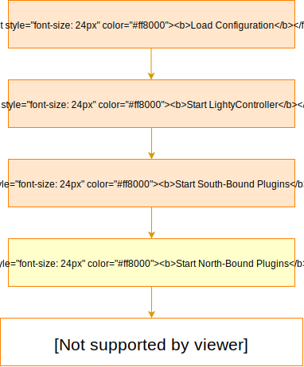

# Example SDN controller applications

The best way how to start consume lighty.io services is to check example applications in this project, usage of lighty core components as well as RESTCONF and NETCONF plugins.

 * Simple [RESTCONF-NETCONF SDN controller](lighty-community-restconf-netconf-app/README.md).
 * Simple [Spring Boot NETCONF SDN controller](lighty-controller-springboot-netconf/README.md).

## Setup controller project
Typical controller project requires initialization of [ODL core services](../lighty-core/lighty-controller/src/main/java/io/lighty/core/controller/api/LightyServices.java), south-bound plugins and optionally RESTCONF north-bound plugin.
ODL core services represent MD-SAL layer, controller, DataStore, global schema context and all related services.

1. Add dependency on lighty.io core services  
```
<dependencies>
   <dependency>
      <groupId>io.lighty.core.parents</groupId>
      <artifactId>lighty-dependency-artifacts</artifactId>
      <version>20.3.0-SNAPSHOT</version>
      <type>pom</type>
      <scope>import</scope>
   </dependency>
</dependencies>        
```

2. Optionally add dependencies on south-bound or north-bound plugins.
 * [RESTCONF NBP](../lighty-modules/lighty-restconf-nb-community/README.md)
 * [NETCONF SBP](../lighty-modules/lighty-netconf-sb/README.md)

3. Initialize and start LightyController
```
LightyControllerBuilder lightyControllerBuilder = new LightyControllerBuilder();
LightyController lightyController = lightyControllerBuilder.from(controllerConfiguration).build();
lightyController.start().get();
```
  
## Controller initialization process
Controller startup sequence consists of 5 easy steps.
Step #4 is optional.



## Controller types
lighty.io supports development of two basic controller types:
* __Standalone controller__ - runs in own JVM as micro service
* __Embedded controller__ - runs with other application components in single JVM

## Update logger with JMX
Java Management Extensions is a tool enabled by default which makes it easy to change runtime
configuration of the application. Among other options, we use [log4j2](https://logging.apache.org/log4j/2.0/manual/jmx.html)
which has built in option to change logging behaviour during runtime via JMX client which can be connected to the running lighty instance.
1. Start the lighty example application
2. Connect the JXM client
   We recommend using `jconsole` because it is part of the standard Java JRE.
   The command for connecting jconsole to JMX server is:
   `jconsole <ip-of-running-lighty>:<JMX-port>`, the default JMX-port is 1099.

This approach works only if the application is running locally.

If you want to connect the JMX client to the application running remotely or containerized (k8s deployment or/and docker),
you need to start the application using the following JAVA_OPTS:
```
JAVA_OPTS = -Dcom.sun.management.jmxremote
             -Dcom.sun.management.jmxremote.authenticate=false
             -Dcom.sun.management.jmxremote.ssl=false
             -Dcom.sun.management.jmxremote.local.only=false
             -Dcom.sun.management.jmxremote.port=<JMX_PORT>
             -Dcom.sun.management.jmxremote.rmi.port=<JMX_PORT>
             -Djava.rmi.server.hostname=127.0.0.1
```
Then run `java $JAVA_OPTS -jar lighty-rnc-app-<version> ...`

If you want to completely disable logger JMX option, run application with following JAVA_OPTS
`java -Dlog4j2.disable.jmx=true -jar lighty-rnc-app-<version> ...`

### Update Logger level in runtime with JMX
After successful start of lighty example application is able to update logger information in runtime.
[Log4j2 JMX](https://logging.apache.org/log4j/2.0/manual/jmx.html) provides more configuration but, for this example, we show how to change logger level.
1) Start `jconsole` (part of the standard Java JRE)
2) Chose lighty example application in local process application
3) Open `MBeans` window and chose `org.apache.logging.log4j2`
4) Chose from dropdown  `loggers` than `StatusLogger` and `level`
5) By double-clicking on level value, can be updated to desire [state](https://logging.apache.org/log4j/2.x/manual/customloglevels.html).
