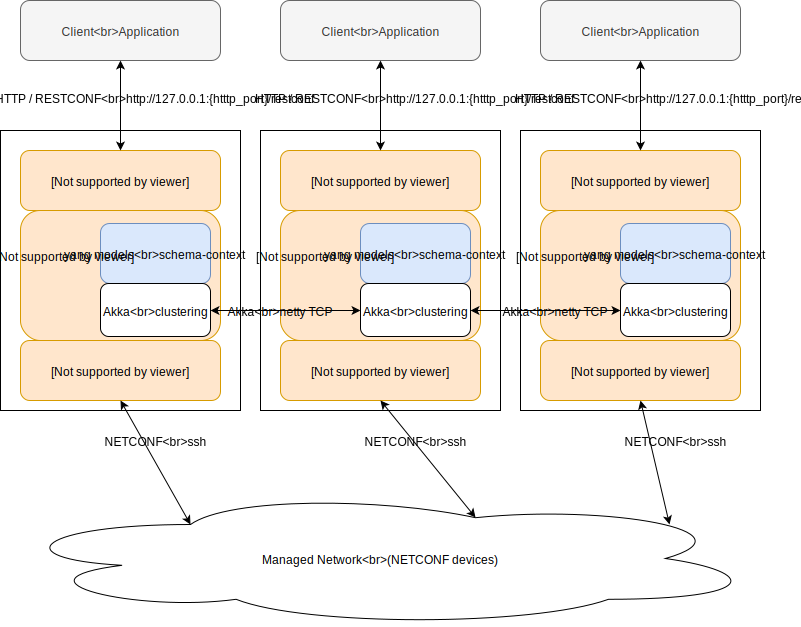
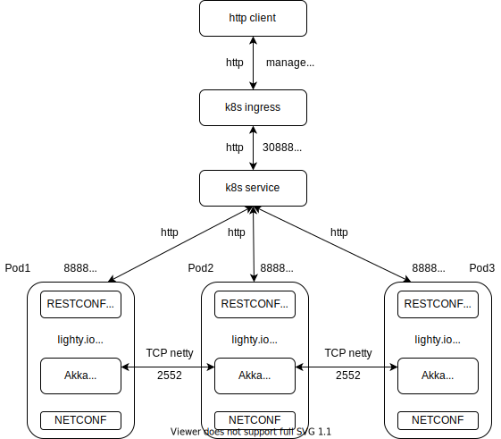

# Lighty Clustered NETCONF/RESTCONF Application

This demo application is based on [NETCONF/RESTCONF Application](../lighty-community-restconf-netconf-app/README.md), but 
demonstrates [Akka cluster](https://doc.akka.io/docs/akka/current/cluster-usage.html) capabilities of [lighty.io](https://github.com/PANTHEONtech/lighty-core) and [OpenDaylight](https://www.opendaylight.org/). 

This application starts:
* Lighty Controller
* OpenDaylight RESTCONF plugin
* OpenDaylight Swagger servlet
* NETCONF south-bound plugin
* OpenDaylight Akka 3-node cluster

## Application architecture


## Build and Run
build the project: ```mvn clean install```

### Start this demo example
* build the project using ```mvn clean install```
* go to target directory ```cd lighty-examples/lighty-cluster-app/target``` 
* unzip example application bundle ```unzip  lighty-cluster-app-12.2.1-SNAPSHOT-bin.zip```
* make 3 separate instances of this application 
```
cp -a lighty-cluster-app-12.2.1-SNAPSHOT lighty-cluster-app-12.2.1-SNAPSHOT-01
cp -a lighty-cluster-app-12.2.1-SNAPSHOT lighty-cluster-app-12.2.1-SNAPSHOT-02
cp -a lighty-cluster-app-12.2.1-SNAPSHOT lighty-cluster-app-12.2.1-SNAPSHOT-03
```
* start all 3 cluster nodes in separate terminals 
```
cd lighty-cluster-app-12.2.1-SNAPSHOT-01
./start-controller-node-01.sh

cd lighty-cluster-app-12.2.1-SNAPSHOT-02
./start-controller-node-02.sh

cd lighty-cluster-app-12.2.1-SNAPSHOT-03
./start-controller-node-03.sh
```
* all 3 cluster nodes are running on localhost ``127.0.0.1``

### Cluster ports on 127.0.0.1
| node instance      | port | service type                     |
|--------------------|------|----------------------------------|
| controller-node-01 | 8186 | restconf websocket notifications |
|                    | 8889 | restconf http                    |
|                    | 2550 | akka netty tcp                   |
|                    | 8558 | akka http management port        |
| controller-node-02 | 8187 | restconf websocket notifications |
|                    | 8890 | restconf http                    |
|                    | 2551 | akka netty tcp                   |
|                    | 8559 | akka http management port        |
| controller-node-02 | 8189 | restconf websocket notifications |
|                    | 8891 | restconf http                    |
|                    | 2552 | akka netty tcp                   |
|                    | 8560 | akka http management port        |

### Akka clustering
This demo utilizes [Akka clustering](https://doc.akka.io/docs/akka/current/cluster-usage.html)
and [Akka cluster http management](https://doc.akka.io/docs/akka-management/current/cluster-http-management.html) extensions.
To get info about cluster state, use following REST call.

__GET__ ``http://127.0.0.1:{akka_http_management_port}/management/cluster/members/``

## Kubernetes deployment
In order to deploy this lighty.io cluster demo into kubernetes cluster, make sure you follow guide below.
This demo was tested using kubernetes cluster v1.16.2.

#### Configure pod-restart-timeout
It is used in situation when Cluster member becomes unreachable but his Pod still remains in Kubernetes.
This means there might be just some temporary connection issue.
The cluster healing mechanism will use this timeout to wait for the member giving it a chance to become reachable again
before issuing restart request to Kubernetes.

If not configured, default timeout (30s) will be used.
```
akka.lighty-kubernetes {
    pod-restart-timeout = 60
}
```
#### Create docker image
```
docker build . -f Dockerfile.k8s -t lighty-k8s-cluster:1.0.0-SNAPSHOT

# run docker
docker run -p 8891:8891 -p 2552:2552 -p 8558:8558 lighty-k8s-cluster:1.0.0-SNAPSHOT

# investigate docker image contents
docker run --entrypoint="" -it lighty-k8s-cluster:1.0.0-SNAPSHOT sh
```

### Deploy into k8s cluster

```
kubectl apply -f lighty-k8s-cluster-roles.yaml
kubectl apply -f lighty-k8s-cluster-deployment.yaml
```
### Scale up and down
```
kubectl scale deployment lighty-k8s-cluster --replicas=5
kubectl scale deployment lighty-k8s-cluster --replicas=3
```

### Undepoloy from k8s cluster
```
kubectl delete service/lighty-k8s-cluster service/lighty-k8s-cluster-lb deployment.apps/lighty-k8s-cluster
```

#### Akka management endpoints:
* __GET__ http://{NodeIp}:8558/cluster/members
* __GET__ http://{NodeIp}:8558/bootstrap/seed-nodes

Where __NodeIp__ is IP address assigned by kubernetes.

#### Load-Balancer REST endpoints  
* __GET__ ``http://{LoadBalancerIp}:30558/cluster/members`` - akka http
* __GET__ ``http://{LoadBalancerIp}:30888/restconf/operations`` - loghty.io RESTCONF 

## Run demo in local environment using microk8s
To start cluster:
1. Install [microk8s](https://microk8s.io/docs) tool
2. Build Docker Image:  
  `docker build . -f Dockerfile.k8s -t lighty-k8s-cluster:1.0.0-SNAPSHOT`
3. Save Docker Image as .tar:  
  `docker save --output="target/lighty-k8s-cluster:1.0.0-SNAPSHOT.tar" lighty-k8s-cluster:1.0.0-SNAPSHOT`
4. Copy saved image into microk8s environment (more information [here](https://microk8s.io/docs/registry-images)).  
  NOTE: defining namespace (`-n k8s.io`) is needed for versions prior to 1.17.  
  `microk8s ctr --namespace k8s.io image import target/lighty-k8s-cluster\:1.0.0-SNAPSHOT.tar`
5. Enable DNS and Ingress:  
  `microk8s enable dns ingress`
6. Apply configurations:  
  `microk8s kubectl apply -f lighty-k8s-cluster-roles.yaml`  
  `microk8s kubectl apply -f lighty-k8s-cluster-deployment.yaml`

To execute REST requests on lighty.io app:
- Inside of the cluster RESTCONF is exposed via port 8888
- Inside of the cluster `akka` management is exposed via port 8558
- Kubernetes `Ingress` contains configuration to redirect requests issued on certain hosts to these services
    - Host `management.lighty.io` is redirected to management port
    - Host `restconf.lighty.io` is redirected to RESTCONF port
- When executing REST request, either:
    - add entries for both hosts to the `/etc/hosts` file (pointing to the `127.0.0.1`) and in the request use URL
    `your-host.com/rest/of/the/url`
    - or in the request use URL `127.0.0.1:80/rest/of/the/url` and set `Host` header manually 


To access Dashboard:
1. Enable Dashboard:  
  `microk8s enable dashboard`
2. Obtain token to log in:  
  `token=$(microk8s kubectl -n kube-system get secret | grep default-token | cut -d " " -f1)`  
   `microk8s kubectl -n kube-system describe secret $token`
3. Go to URL `https://127.0.0.1:10443`
4. Log in using obtained token in previous steps

To reset and clean microk8s environment:
1. Delete started service:  
  `microk8s kubectl delete service/lighty-k8s-cluster service/lighty-k8s-cluster-lb deployment.apps/lighty-k8s-cluster`
2. Reset microk8s:  
  `microk8s reset`
