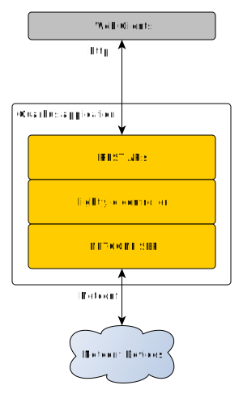

# Lighty NETCONF Application using Quarkus.io & GraalVM
This application utilizes NETCONF south-bound plugin to manage NETCONF devices on the network. 
Application works as standalone SDN controller. It is capable to connect to NETCONF devices 
and expose connected devices over custom REST north-bound APIs.
This demo shows how to run [lighty.io](https://lighty.io/) in [quarkus.io](https://quarkus.io/) framework.

Application initializes OpenDaylight core components (MD-SAL, yangtools and controller) and NetConf Southbound plugin inside quarkus.io environment.



## Install environment
Once you have [downloaded GraalVM](https://github.com/oracle/graal/releases), 
extract the archive and set the environment variables:
```
export PATH={YOUR_PATH}/graalvm-ce-19.0.2/bin:$PATH
export GRAALVM_HOME={YOUR_PATH}/graalvm-ce-19.0.2/
export JAVA_HOME={YOUR_PATH}/graalvm-ce-19.0.2/
```
Install native image support for graalVM
```
gu install native-image
```

## Build & Run
build and run the project: 
```
mvn clean compile quarkus:dev
```

## Build package & Run
```
mvn clean package
java -Xms128m -Xmx128m -XX:MaxMetaspaceSize=128m -jar target/lighty-quarkus-netconf-app-12.3.1-SNAPSHOT-runner.jar
```

## Build native image
build native image: 
```
mvn clean package -Pnative
```

### Using REST APIs
This [postman collection](docs/lighty.io-quarkus.io-demo.postman_collection.json) 
contains implemented REST API examples.

### Performance measurements
Parameters measured after application start.

| Property Name                     | lighty.io **   |
|-----------------------------------|----------------|
| Build size                        |  72 MB         |
| Startup Time                      |  ~4.8          |
| Shutdown Time                     |  ~100ms        |
| Process memory allocated (RSS)*** |  541 MB        |
| HEAP memory (used/allocated)      |  25 / 128 MB   |
| Metaspace (used/allocated)        |  66 / 62 MB    |
| Threads (live/daemon)             |  86 / 17       |
| Classes loaded                    |  12147         |
| No. of jars                       |  254           |

```** -Xms128m -Xmx128m -XX:MaxMetaspaceSize=128m```  
```*** sudo ps -o pid,rss,user,command ax | grep java | grep quarkus```
