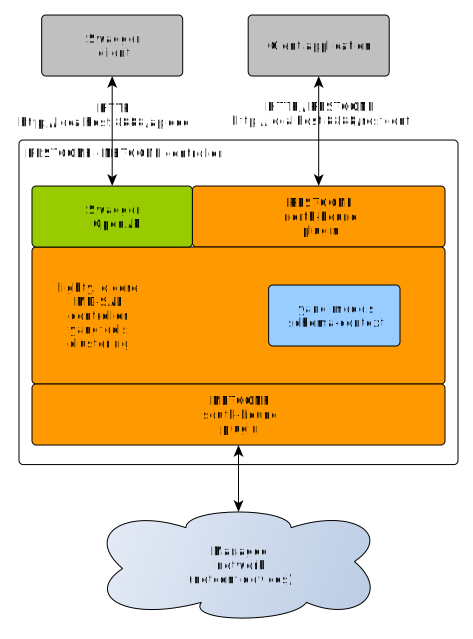

# Lighty RESTCONF Actions Application
This application provides RESTCONF north-bound interface with examples of DOM and binding action registration on the controller.

This application starts:
* Lighty Controller
* OpenDaylight RESTCONF plugin
* OpenDaylight OpenApi servlet
* NETCONF south-bound plugin



This roughly translates to OpenDaylight feature set installed by karaf command:
```
feature:install odl-netconf-all
```

## Build and Run
build the root project: ```mvn clean install```

### Start this demo example
* build the project using ```mvn clean install```
* go to target directory ```cd lighty-examples/lighty-community-restconf-dom-actions-app/target``` 
* unzip example application bundle ```unzip  lighty-community-restconf-dom-actions-app-<VERSION>-bin.zip```
* go to unzipped application directory ```cd lighty-community-restconf-dom-actions-app-<VERSION>```
* start controller example controller application ```java -jar lighty-community-restconf-domo-actions-app-<VERSION>.jar``` 

### Test example application
Once example application has been started using command ```java -jar lighty-community-restconf-dom-actions-app-<VERSION>.jar``` 
RESTCONF web interface is available at URL ```http://localhost:8888/restconf/*```

##### URLs to start with
* __POST__ ```http://127.0.0.1:8888/restconf/data/example-data-center:device/start```

In this example you invoke an action operating on the container "device" defined by
[example-data-center](../../lighty-models/test/lighty-example-data-center/src/main/yang/example-data-center@2018-08-07.yang)
YANG model. In the input you specify "start-at" value.
The input value is passed as is by action's
[implementation](./src/main/java/io/lighty/examples/controllers/actions/dom/DeviceStartActionImpl.java)
to output's "start-finished-at" value.
No data are modified during the execution. The implementation is using DOM API.

1. Use the payload like the following:
```json
{
    "input": {
        "start-at": "2021-09-09T16:20:00Z"
    }
}
```

2. You will receive output like the following:

```json
{
    "example-data-center:output": {
        "example-data-center:start-finished-at": "2021-09-09T16:20:00Z"
    }
}
```
* __POST__ ```http://127.0.0.1:8888/restconf/data/example-data-center:server=server-earth/reset```

In this example you invoke an action operating on the list "reset" defined by
[example-data-center](../../lighty-models/test/lighty-example-data-center/src/main/yang/example-data-center@2018-08-07.yang)
YANG model. In the input you specify "reset-at" value.
The input value is passed as is by action's
[implementation](./src/main/java/io/lighty/examples/controllers/actions/binding/ServerResetActionImpl.java)
to output's "reset-finished-at" value.
No data are modified during the execution. The implementation is using binding API.

1. Use the payload like the following:
```json
{
    "input": {
        "reset-at": "2021-09-09T16:20:00Z"
    }
}
```

2. You will receive output like the following:

```json
{
    "example-data-center:output": {
        "example-data-center:reset-finished-at": "2021-09-09T16:20:00Z"
    }
}
```
##### OpenApi UI
This application example has active [OpenApi](https://swagger.io/) UI for RESTCONF.

URL for OpenApi: https://datatracker.ietf.org/doc/html/rfc8040
* __OpenApi UI__ ``http://localhost:8888/openapi/explorer/index.html``

### Use custom config files
There are two separated config files: for NETCONF SBP single node and for cluster.
`java -jar lighty-community-restconf-dom-actions-app-<VERSION>.jar /path/to/singleNodeConfig.json`

Example configuration for single node is [here](src/main/assembly/resources/sampleConfigSingleNode.json)

## Setup Logging
Default logging configuration may be overwritten by JVM option
```-Dlog4j.configurationFile=path/to/log4j2.xml```

Content of ```log4j2.xml``` is described [here](https://logging.apache.org/log4j/2.x/manual/configuration.html).
