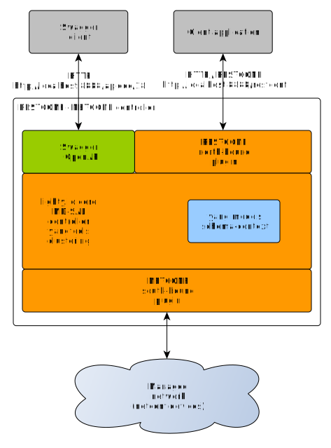

# Lighty RESTCONF DOM Actions Application
This application provides RESTCONF north-bound interface with example of DOM action registration on the controller.

This application starts:
* Lighty Controller
* OpenDaylight RESTCONF plugin
* OpenDaylight Swagger servlet
* NETCONF south-bound plugin



This roughly translates to OpenDaylight feature set installed by karaf command:
```
feature:install odl-netconf-all
```

## Build and Run
build the project: ```mvn clean install```

### Start this demo example
* build the project using ```mvn clean install```
* go to target directory ```cd lighty-examples/lighty-community-restconf-dom-actions-app/target```
* unzip example application bundle ```unzip  lighty-community-restconf-dom-actions-app-<VERSION>-bin.zip```
* go to unzipped application directory ```cd lighty-community-restconf-dom-actions-app-<VERSION>```
* start controller example controller application ```java -jar lighty-community-restconf-domo-actions-app-<VERSION>.jar``` 

### Test example application
Once example application has been started using command ```java -jar lighty-community-restconf-dom-actions-app-<VERSION>.jar``` 
RESTCONF web interface is available at URL ```http://localhost:8888/restconf/*```

##### URLs to start with
* __POST__ ```http://127.0.0.1:8888/restconf/data/example-data-center:device/start```

1. Use the payload like the following:
```json
{
    "input": {
        "start-at": "2021-09-09T16:20:00Z"
    }
}
```

2. You will receive output like the following:

```json
{
    "example-data-center:output": {
        "example-data-center:start-finished-at": "2021-09-09T16:20:00Z"
    }
}
```

##### Swagger UI
This application example has active [Swagger](https://swagger.io/) UI for RESTCONF.

URLs for Swagger (choose RESTCONF [draft18](https://tools.ietf.org/html/draft-ietf-netconf-restconf-18) or
[draft02](https://tools.ietf.org/html/draft-bierman-netconf-restconf-02) in upper right corner):
* __Swagger UI__ ``http://localhost:8888/apidoc/18/explorer/index.html``

### Use custom config files
There are two separated config files: for NETCONF SBP single node and for cluster.
`java -jar lighty-community-restconf-dom-actions-app-<VERSION>.jar /path/to/singleNodeConfig.json`

Example configuration for single node is [here](src/main/assembly/resources/sampleConfigSingleNode.json)

## Setup Logging
Default loging configuration may be overwritten by JVM option
```-Dlog4j.configuration=/path/to/log4j.properties```

Content of ```log4j.properties``` is described [here](https://logging.apache.org/log4j/2.x/manual/configuration.html).
