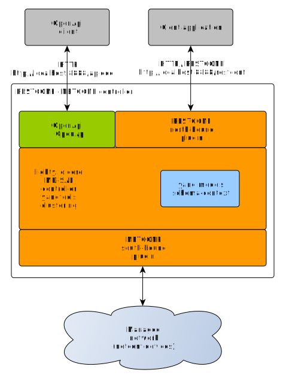

# Lighty NETCONF/RESTCONF Application
This application provides RESTCONF north-bound interface and utilizes NETCONF south-bound plugin to manage NETCONF devices on the network. 
Application works as standalone SDN controller. It is capable to connect to NETCONF devices and expose connected devices over RESTCONF north-bound APIs.

This application starts:
* Lighty Controller
* OpenDaylight RESTCONF plugin
* OpenDaylight OpenApi servlet
* NETCONF south-bound plugin



This roughly translates to OpenDaylight feature set installed by karaf command:
```
feature:install odl-netconf-all
```

## Build and Run
build the project: ```mvn clean install```

### Start this demo example
* build the project using ```mvn clean install```
* go to target directory ```cd lighty-examples/lighty-community-restconf-netconf-app/target``` 
* unzip example application bundle ```unzip  lighty-community-restconf-netconf-app-20.1.0-SNAPSHOT-bin.zip```
* go to unzipped application directory ```cd lighty-community-restconf-netconf-app-20.1.0-SNAPSHOT```
* start controller example controller application ```java -jar lighty-community-restconf-netconf-app-20.1.0-SNAPSHOT.jar``` 

### Test example application
Once example application has been started using command ```java -jar lighty-community-restconf-netconf-app-20.1.0-SNAPSHOT.jar``` 
RESTCONF web interface is available at URL ```http://localhost:8888/restconf/*```

##### URLs to start with
* __GET__ ```http://localhost:8888/restconf/operations```
* __GET__ ```http://localhost:8888/restconf/data/network-topology:network-topology?content=config```
* __GET__ ```http://localhost:8888/restconf/data/network-topology:network-topology?content=nonconfig```

##### OpenApi UI
This application example has active [OpenApi](https://swagger.io/) UI for RESTCONF.

URLs for OpenApi: https://datatracker.ietf.org/doc/html/rfc8040
* __OpenApi UI__ ``http://localhost:8888/openapi/explorer/index.html``

### Use custom config files
There are two separated config files: for NETCONF SBP single node and for cluster.
`java -jar lighty-community-restconf-netconf-app-20.1.0-SNAPSHOT.jar /path/to/singleNodeConfig.json`

Example configuration for single node is [here](src/main/assembly/resources/sampleConfigSingleNode.json)

## Setup Logging
Default logging configuration may be overwritten by JVM option
```-Dlog4j.configurationFile=path/to/log4j2.xml```

Content of ```log4j2.xml``` is described [here](https://logging.apache.org/log4j/2.x/manual/configuration.html).
