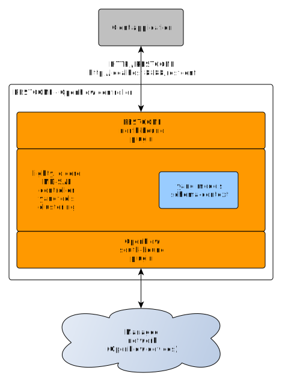

# Lighty OpenFlow with RESTCONF

This application contains and will start these modules:
* Lighty Controller
* Lighty Community RESTCONF
* Openflow plugin (OFP)



## Build and Run
Build the project using maven command: ```mvn clean install```.
This will create *.zip* archive in target directory. Extract this archive
and run *.jar* file using java with command:
```
java -jar lighty-community-restconf-ofp-app-12.3.1-SNAPSHOT.jar
```

### Use custom config files
Previous command will run application with default configuration. In order
to run it with custom configuration, edit (or create new) *json* configuration file.
Example of *json* configuration can be found [here](src/main/assembly/resources/sampleConfigSingleNode.json).
This example configuration will be copied to *.zip* archive in target directory
after build.

When running application pass path to configuration file as argument:
```
java -jar lighty-community-restconf-ofp-app-12.3.1-SNAPSHOT.jar sampleConfigSingleNode.json
```

### Building and running Docker Image
- Go into app main directory > lighty-community-restconf-ofp-app
- Make sure your app is built beforehand.
- Run ```docker build -t ofp .``` to build image under 'ofp' name.
- Start container with ```docker run -it --rm --name ofp_container ofp```
- Find out container ip with
 ```
 docker inspect -f "{{range .NetworkSettings.Networks}}{{.IPAddress}}{{end}}" ofp_container
 ```
 - Use the IP for your RESTCONF calls.

### Openflow plugin and RESTCONF configuration
If is need to add Packet-handler to program. It will be proceed in Main example code
where is starting Openflow plugin:
```
//3. start openflow SBP
     final OpenflowSouthboundPlugin plugin;
     plugin = new OpenflowSouthboundPluginBuilder()
             .from(configuration, lightyController.getServices())
             .build();
     ListenableFuture<Boolean> start = plugin.start();
```

Packet handling is managed by adding Packet Listener. In our example we add Packet-in Listener.
Which will be logging packet-in messages. For new packet listener is important to implement
class "PacketProcessingListener".
```
//3. start openflow SBP
     PacketProcessingListener packetInListener = new PacketInListener();
     final OpenflowSouthboundPlugin plugin;
     plugin = new OpenflowSouthboundPluginBuilder()
             .from(configuration, lightyController.getServices())
             .withPacketListener(packetInListener)
             .build();
     ListenableFuture<Boolean> start = plugin.start();
 ```

FLOWs can be added to OFP in two ways. 
- First way is put FLOW to config data-store and ForwardingRulesManager (FRM) 
will add this flow to device via RPC call. When is FRM enabled and FLOW is add to config data-store then will be this 
FLOW persistent until user will decide to delete it.
- Second way is by RPC call, which add FLOW directly to device. When will be device restart all flows added by RPC calls will be lost.
RPC calls can be used with enabled FRM. 

By default will be OFP plugin start with FRM but could be disabled in [main](src/main/java/io/lighty/examples/controllers/restconf/ofp/Main.java) class.
```
//3. start openflow SBP
     configuration.setEnableForwardingRulesManager(false);
```
Other way to disable FRM is start OFP with external configuration. In this json configuration can be changed 
EnableForwardingRulesManager property to false.

RESTCONF configuration could be changed in json config file mention before. 
there is possible to change RESTCONF port, ip address or version of RESTCONF. 
Now is version of RESTCONF set to DRAFT_18 but could be also set to DRAFT_02.
```
"restconf": {
    "httpPort": 8888,
    "restconfServletContextPath": "/restconf",
    "inetAddress": "0.0.0.0",
    "jsonRestconfServiceType": "DRAFT_18"
  },
```

## How to use Openflow example
In order to try openflow application, follow these steps:
- Start openflow example application
- Start mininet with at least one openflow switch ([download instructions](http://mininet.org/download/) use version 2.2.0 and higher)

```
sudo mn --controller=remote,ip=<IP_OF_RUNNING_LIGHTY> --topo=tree,1 --switch ovsk,protocols=OpenFlow13
```
For explanation of OFP usage is RESTCONF set to DRAFT_18. All RESTCONF calls used in example, could be import from 
[file](docs/OFP_postman_collection.json) in project resources to Postman.

Quick check that controller is owner of the connected device. If it is not, controller is not running
or device is not properly connected.

```
curl --request GET \
  --url http://<IP_OF_RUNNING_LIGHTY>:8888/restconf/data/entity-owners:entity-owners \
  --header 'Authorization: Basic YWRtaW46YWRtaW4='
```
If you following instructions and there is single controller running (not cluster)
and only one device connected the result is:
```
{
  "entity-owners": {
    "entity-type": [{
      "type": "org.opendaylight.mdsal.ServiceEntityType",
      "entity": [{
        "id": "/odl-general-entity:entity[name='openflow:1']",
        "candidate": [{
          "name": "member-1"
        }],
        "owner": "member-1"
      }]
    }, {
      "type": "org.opendaylight.mdsal.AsyncServiceCloseEntityType",
      "entity": [{
        "id": "/odl-general-entity:entity[name='openflow:1']",
        "candidate": [{
          "name": "member-1"
        }],
        "owner": "member-1"
      }]
    }]
  }
}
```
- Lets get information about the connected device.

From config:
```
curl --request GET \
  --url http:///<IP_OF_RUNNING_LIGHTY>:8888/restconf/data/opendaylight-inventory:nodes/node=openflow%3A1 \
  --header 'Authorization: Basic YWRtaW46YWRtaW4='
```
From operational:
```
curl --request GET \
  --url http:///<IP_OF_RUNNING_LIGHTY>:8888/restconf/data/opendaylight-inventory:nodes/node=openflow%3A1?content=nonconfig \
  --header 'Authorization: Basic YWRtaW46YWRtaW4='
```
Result json starts with:
```
{
  "node": [{
    "id": "openflow:1",
    "node-connector": [{
      "id": "openflow:1:LOCAL",
      "flow-node-inventory:peer-features": "",
      "flow-node-inventory:advertised-features": "",
      "flow-node-inventory:port-number": 4294967294,
      "flow-node-inventory:hardware-address": "4a:15:31:79:7f:44",
      "flow-node-inventory:supported": "",
      "flow-node-inventory:current-speed": 0,
      "flow-node-inventory:current-feature": "",
      "flow-node-inventory:state": {
        "live": false,
        "link-down": true,
        "blocked": false
      },
      "flow-node-inventory:maximum-speed": 0,
      "flow-node-inventory:name": "s1",
      "flow-node-inventory:configuration": "PORT-DOWN"
    }, {
      "id": "openflow:1:2",
      "flow-node-inventory:peer-features": "",
      "flow-node-inventory:advertised-features": "",
      "flow-node-inventory:port-number": 2,
      "flow-node-inventory:hardware-address": "fa:c3:2c:97:9e:45",
      "flow-node-inventory:supported": "",
      "flow-node-inventory:current-speed": 10000000,
      "flow-node-inventory:current-feature": "ten-gb-fd copper",
      "flow-node-inventory:state": {
        "live": false,
        "link-down": false,
        "blocked": false
      },
      .
      .
      .
```
-Now try to add table-miss flow, which will modified switch to send all not matched packet to controller via packet-in messages.

To config data-store:
```
curl --request PUT \
  --url http://<IP_OF_RUNNING_LIGHTY>:8888/restconf/data/opendaylight-inventory:nodes/node=openflow%3A1/table=0/flow=1 \
  --header 'Authorization: Basic YWRtaW46YWRtaW4=' \
  --header 'Content-Type: application/xml' \
  --data '<?xml version="1.0" encoding="UTF-8" standalone="no"?>
<flow xmlns="urn:opendaylight:flow:inventory">
   <barrier>false</barrier>
   <cookie>54</cookie>
   <flags>SEND_FLOW_REM</flags>
   <flow-name>FooXf54</flow-name>
   <hard-timeout>0</hard-timeout>
   <id>1</id>
   <idle-timeout>0</idle-timeout>
   <installHw>false</installHw>
   <instructions>
       <instruction>
           <apply-actions>
               <action>
                   <output-action>
                       <max-length>65535</max-length>
                       <output-node-connector>CONTROLLER</output-node-connector>
                   </output-action>
                   <order>0</order>
               </action>
           </apply-actions>
           <order>0</order>
       </instruction>
   </instructions>
   <match/>
   <priority>0</priority>
   <strict>false</strict>
   <table_id>0</table_id>
</flow>'
```
To device via RPC call:
```
curl --request POST \
  --url http://<IP_OF_RUNNING_LIGHTY>:8888/restconf/operations/sal-flow:add-flow \
  --header 'Authorization: Basic YWRtaW46YWRtaW4=' \
  --header 'Content-Type: application/json' \
  --data '{
    "input": {
      "opendaylight-flow-service:node":"/opendaylight-inventory:nodes/opendaylight-inventory:node[opendaylight-inventory:id='\''openflow:1'\'']",
      "priority": 0,
      "table_id": 0,
      "instructions": {
        "instruction": [
          {
            "order": 0,
            "apply-actions": {
              "action": [
                {
                  "order": 0,
                  "output-action": {
                    "max-length": "65535",
                    "output-node-connector": "CONTROLLER"
                  }
                }
              ]
            }
          }
        ]
      },
      "match": {
      }
    }
}'
```


- Check if flow is on the device:

In config:
```
curl --request GET \
  --url http://<IP_OF_RUNNING_LIGHTY>:8888/restconf/data/opendaylight-inventory:nodes/node=openflow%3A1/table=0 \
  --header 'Authorization: Basic YWRtaW46YWRtaW4='
```
In operational:
```
curl --request GET \
  --url http://<IP_OF_RUNNING_LIGHTY>:8888/restconf/data/opendaylight-inventory:nodes/node=openflow%3A1/table=0?content=nonconfig \
  --header 'Authorization: Basic YWRtaW46YWRtaW4='
```

Result:
```
{
    "flow-node-inventory:table": [
        {
            "id": 0,
            "opendaylight-flow-table-statistics:flow-table-statistics": {
                "active-flows": 1,
                "packets-looked-up": 14,
                "packets-matched": 4
            },
            "flow": [
                {
                    "id": "1",
                    "priority": 0,
                    "opendaylight-flow-statistics:flow-statistics": {
                        "packet-count": 4,
                        "byte-count": 280,
                        "duration": {
                            "nanosecond": 936000000,
                            "second": 22
                        }
                    },
                    "table_id": 0,
                    "cookie_mask": 0,
                    "hard-timeout": 0,
                    "match": {},
                    "cookie": 54,
                    "flags": "SEND_FLOW_REM",
                    "instructions": {
                        "instruction": [
                            {
                                "order": 0,
                                "apply-actions": {
                                    "action": [
                                        {
                                            "order": 0,
                                            "output-action": {
                                                "max-length": 65535,
                                                "output-node-connector": "CONTROLLER"
                                            }
                                        }
                                    ]
                                }
                            }
                        ]
                    },
                    "idle-timeout": 0
                }
            ]
        }
    ]
}
```

Get FLOW from modified device s1 in command line:
```
sudo ovs-ofctl -O OpenFlow13 dump-flows s1
```
Device result:
```
cookie=0x36, duration=140.150s, table=0, n_packets=10, n_bytes=700, send_flow_rem priority=0 actions=CONTROLLER:65535
```

- Update FLOW

Works same as adding flow. OFP will find flow openflow:1, table=0, flow=1 and update changes.

- Delete FLOW

From config data-store:
```
curl --request DELETE \
  --url http://<IP_OF_RUNNING_LIGHTY>:8888/restconf/data/opendaylight-inventory:nodes/node=openflow%3A1/table=0/flow=1 \
  --header 'Authorization: Basic YWRtaW46YWRtaW4=' \
  --header 'Content-Type: application/xml' \
  --data ''
```

via RPC calls:
```
curl --request POST \
  --url http://<IP_OF_RUNNING_LIGHTY>:8888/restconf/operations/sal-flow:remove-flow \
  --header 'Authorization: Basic YWRtaW46YWRtaW4=' \
  --header 'Content-Type: application/json' \
  --data '{
    "input": {
      "opendaylight-flow-service:node":"/opendaylight-inventory:nodes/opendaylight-inventory:node[opendaylight-inventory:id='\''openflow:1'\'']",
      "table_id": 0
    }
}'
```

## Setup logging
Default logging configuration may be overwritten by JVM option
```-Dlog4j.configuration=/path/to/log4j.properties```

Content of ```log4j.properties``` is described [here](https://logging.apache.org/log4j/2.x/manual/configuration.html).
