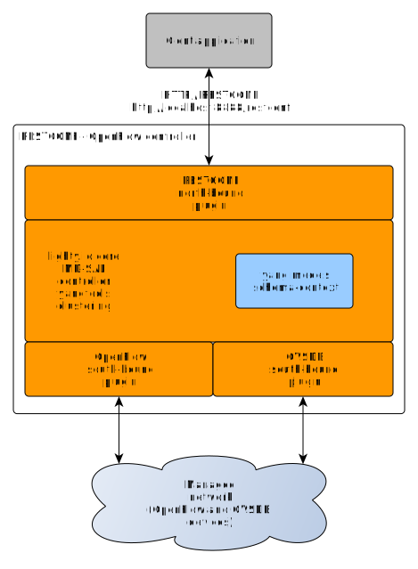

# SDN controller with RESTCONF NB and OpenFlow, OVSDB SBs

This application contains and will start these modules:
* LightyController
* Lighty Community RESTCONF northbound plugin
* OpenFlow southbound plugin
* OVSDB southbound plugin



## Build and Run
Build the project using maven command: ```mvn clean install```.
This will create *.zip* archive in target directory. Extract this archive
and run *.jar* file using java with command:
```
java -jar lighty-community-restconf-ofpovsdb-app-9.2.1-SNAPSHOT.jar
```

### Use custom config files
Previous command will run application with default configuration. In order
to run it with custom configuration, edit (or create new) *json* configuration file.
Example of *json* configuration can be found [here](src/main/assembly/resources/sampleConfig.json).
This example configuration will be copied to *.zip* archive in target directory
after build.

When running application pass path to configuration file as argument:
```
java -jar lighty-community-restconf-ofpovsdb-app-9.2.1-SNAPSHOT.jar sampleConfigSingleNode.json
```

## Building and running Docker Image
- Go into app main directory > lighty-community-restconf-ofp-ovsdb-app
- Make sure your app is built beforehand.
- Run ```docker build -t ofp-ovsdb .``` to build image under 'ofp-ovsdb' name.
- Start container with ```docker run -it --rm --name ofp_ovsdb_container ofp-ovsdb```
- Find out container ip with
 ```
 docker inspect -f "{{range .NetworkSettings.Networks}}{{.IPAddress}}{{end}}" ofp_ovsdb_container
 ```
 - Use the IP for your restconf calls.


## Setup logging
Default logging configuration may be overwritten by JVM option
```-Dlog4j.configuration=/path/to/log4j.properties```

Content of ```log4j.properties``` is described [here](https://logging.apache.org/log4j/2.x/manual/configuration.html).


## Open vSwitch orchestration over OVSDB and OpenFlow
This SDN controller application can be used for complete orchestration of any device
supporting OVSDB, OpenFlow or both. An example of device which requires orchestration using
OVSDB and OpenFlow simultaneously is Open vSwitch - [https://www.openvswitch.org/](https://www.openvswitch.org/).

### OpenFlow SB plugin
This SDN controller application uses OpenFlow SB plugin which implements
OpenFlow controller for OpenFlow switches.
For more information, see README.md file of [lighty-community-restconf-ofp-app](../lighty-community-restconf-ofp-app/README.md)

### OVSDB SB plugin
Also OVSDB SB plugin is used by this controller.
For more information, see README.md file of [lighty-community-restconf-ovsdb-app](../lighty-community-restconf-ovsdb-app/README.md)

### OpenStack Open vSwitch orchestration setup
There's an example Postman collection in src/main/assembly/resources/OVSDB_OpenFlow_draft18.postman_collection.json
The collection contains a set of requests as an example workflow including OVSDB and OpenFlow connection setup and
several retrieve request examples.

The collection has been tested in environment with Open vSwitch instance running in OpenStack set up by DevStack scripts.

The following setup parameters are used in testing environment:
- SDN controller is running on machine with IP address 10.14.0.160 with RESTCONF NB plugin opening port 8888
- Postman or curl requests are submitted from the same machine where SDN controller is running, so URLs use localhost address (127.0.0.1)
- Open vSwitch instance is running on machine with ip address 10.14.0.103 (the same address used in ovs-vsctl command explained above)
- a TCP port used for OVSDB server(s) is 6640
- a TCP port used by OpenFlow server(s) is 6633

NOTE1: A python module json.tool is used for pretty printing of JSON data:
<curl command> | python -m json.tool

NOTE2: 'ovsdb://HOST1' must be used as node-id because there's an issue with OVSDB SB plugin causing crashes
when another node-id is used. 

The following sections shows the example requests from the Postman collection.


##### 0. Configure OVSDB manager of Open vSwitch
At the first it is need to (manually) configure Open vSwitch to be listening to OVSDB connections. In the
OpenStack environment, the Open vSwitch instance(s) have already configured localhost port 6640
which is used by OpenStack Neutron service. Since we do not want to break this connection, we will
use this ovs-vsctl command:
```
sudo ovs-vsctl set-manager ptcp:6640:127.0.0.1 ptcp:6640:10.14.0.103
```

The command above configures two OVSDB servers to be started by the same Open vSwitch instance:
- ptcp:6640:127.0.0.1 - This is the default server used by Neutron service
- ptcp:6640:10.14.0.103 - This command configure OVSDB server listening on TCP port 6640 on network
interface of the host OS where Open vSwitch is running. Our SDN controller application will connect
to this server.


##### 1. Setup OVSDB connection:
```
curl -v --request PUT \
  --url http://127.0.0.1:8888/restconf/data/network-topology:network-topology/topology=ovsdb%3A1/node=ovsdb%3A%2F%2FHOST1 \
  --header 'Authorization: Basic YWRtaW46YWRtaW4=' \
  --header 'Content-Type: application/json' \
  --data '{
        "network-topology:node": [
          {
            "node-id": "ovsdb://HOST1",
            "connection-info": {
              "ovsdb:remote-port": "6640",
              "ovsdb:remote-ip": "10.14.0.103"
            }
          }
        ]
      }'
```


##### 2. Retrieve OVSDB network topology data (all nodes):
This RPC request returns the same data as can be seen as output of ovs-vsctl command:
```
sudo ovs-vsctl show
```

```
curl -v --request GET \
  --url http://127.0.0.1:8888/restconf/data/network-topology:network-topology/topology=ovsdb%3A1 \
  --header 'Authorization: Basic YWRtaW46YWRtaW4=' \
  --header 'Accept: application/json' \
  | python -m json.tool
```


##### 3. Retrieve specific node from OVSDB topology data ("node-id": "ovsdb://HOST1"):
```
curl -v --request GET \
  --url http://127.0.0.1:8888/restconf/data/network-topology:network-topology/topology=ovsdb%3A1/node=ovsdb%3A%2F%2FHOST1 \
  --header 'Authorization: Basic YWRtaW46YWRtaW4=' \
  --header 'Accept: application/json' \
  | python -m json.tool
```


##### 4. Retrieve OVSDB data of specific bridge (br-int):
```
curl -v --request GET \
  --url http://127.0.0.1:8888/restconf/data/network-topology:network-topology/topology=ovsdb%3A1/node=ovsdb%3A%2F%2FHOST1%2Fbridge%2Fbr-int \
  --header 'Authorization: Basic YWRtaW46YWRtaW4=' \
  --header 'Accept: application/json' \
  | python -m json.tool
```

The output of this request shows for example OpenFlow controllers configured for the bridge.
In the snippet under, there's configured only OpenFlow controller running at localhost and
the Open vSwitch is connected to the controller.
```
            "ovsdb:controller-entry": [
                {
                    "target": "tcp:127.0.0.1:6633",
                    "controller-uuid": "d1f4ceaa-b707-49d8-9554-c44bb43c4e59",
                    "is-connected": true
                }
            ],
```


##### 5. Setup our SDN controller as OpenFlow controller for bridge br-int:
```
curl -v --request PUT \
  --url http://localhost:8888/restconf/data/network-topology:network-topology/topology=ovsdb%3A1/node=ovsdb%3A%2F%2FHOST1%2Fbridge%2Fbr-int \
  --header 'Authorization: Basic YWRtaW46YWRtaW4=' \
  --header 'Content-Type: application/json' \
  --data '{
            "network-topology:node": [
                  {
                    "node-id": "ovsdb://HOST1/bridge/br-int",
                       "ovsdb:bridge-name": "br-int",
                        "ovsdb:controller-entry": [
                          {
                            "target": "tcp:10.14.0.160:6633"
                          }
                        ]
                  }
              ]
          }'
```


##### 6. Check the state of the OpenFlow connection - retrieve the controller-entry list of br-int:
```
curl -v --request GET \
  --url http://localhost:8888/restconf/data/network-topology:network-topology/topology=ovsdb%3A1/node=ovsdb%3A%2F%2FHOST1%2Fbridge%2Fbr-int/controller-entry=tcp%3A10.14.0.160%3A6633 \
  --header 'Authorization: Basic YWRtaW46YWRtaW4=' \
  --header 'Accept: application/json' \
  | python -m json.tool
```

If the connection is established then the item "is-connected" is set to true:
```
{
    "ovsdb:controller-entry": [
        {
            "controller-uuid": "5bfe55c9-70da-4e3b-b1ff-c6ecc8b6e62c",
            "is-connected": true,
            "target": "tcp:10.14.0.160:6633"
        }
    ]
}
```


##### 7. Retrieve OpenFlow network topology:
```
curl -v --request GET \
  --url http://127.0.0.1:8888/restconf/data/network-topology:network-topology/topology=flow%3A1 \
  --header 'Authorization: Basic YWRtaW46YWRtaW4=' \
  --header 'Accept: application/json' \
  | python -m json.tool
```


##### 8. Retrieve OpenFlow data of all nodes (reply includes also OpenFlow flow tables):
```
curl -v --request GET \
  --url http://127.0.0.1:8888/restconf/data/opendaylight-inventory:nodes \
  --header 'Authorization: Basic YWRtaW46YWRtaW4=' \
  --header 'Accept: application/json' \
  | python -m json.tool
```


##### 9. Retrieve OpenFlow data of specific node (reply includes also OpenFlow flow tables):
This request uses node-id in the URL. The node-id can be found in reply to requests 7. and 8.

```
curl -v --request GET \
  --url http://127.0.0.1:8888/restconf/data/opendaylight-inventory:nodes/node=openflow%3A143423481343818 \
  --header 'Authorization: Basic YWRtaW46YWRtaW4=' \
  --header 'Accept: application/json' \
  | python -m json.tool
```


##### 10. Retrieve specific OpenFlow table of specific node:
```
curl -v --request GET \
  --url http://127.0.0.1:8888/restconf/data/opendaylight-inventory:nodes/node=openflow%3A143423481343818/table=0 \
  --header 'Authorization: Basic YWRtaW46YWRtaW4=' \
  --header 'Accept: application/json' \
  | python -m json.tool
```


##### 11. Delete OpenFlow controller connection from Open vSwitch configuration of bridge br-int: 
```
curl -v --request DELETE \
  --url http://localhost:8888/restconf/data/network-topology:network-topology/topology=ovsdb%3A1/node=ovsdb%3A%2F%2FHOST1%2Fbridge%2Fbr-int/controller-entry=tcp%3A10.14.0.160%3A6633 \
  --header 'Authorization: Basic YWRtaW46YWRtaW4='
```


##### 12. Close OVSDB connection to the Open vSwitch instance: 
```
curl -v --request DELETE \
  --url http://127.0.0.1:8888/restconf/data/network-topology:network-topology/topology=ovsdb%3A1/node=ovsdb%3A%2F%2FHOST1 \
  --header 'Authorization: Basic YWRtaW46YWRtaW4='
```
