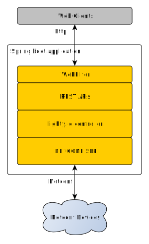

# lighty.io SpringBoot integration example

This is simple demo application which uses Lighty with NETCONF Southbound plugin inside Spring Boot.

Application initializes [OpenDaylight](https://www.opendaylight.org/) core components (MD-SAL, yangtools and controller) and NetConf Southbound plugin
inside spring framework environment.

There is initialized fully functional md-sal inside the spring. The DataBroker is provided for SpringBoot dependency
injection subsystem services and used in exposed REST endpoints. The REST endpoints provides very simple functionality
for network-topology model inside global datastore.

Alongside the basic data broker, there is also integrated NETCONF Southbound plugin and some very basic NetConf
functionality exposed through REST endpoints. The "lighty-toaster-device" was used as a NetConf device which uses
toaster model from [ODL repository](https://github.com/YangModels/yang/blob/19fea483099dbf2864b3c3186a789d12d919f4db/experimental/odp/toaster.yang). 



## Security
This demo utilizes Spring's [method security](https://docs.spring.io/spring-security/reference/servlet/authorization/method-security.html) 
and [jCasbin](https://github.com/casbin/jcasbin). Web layer injects spring SecurityContext so it is available for other beans in application.  

* __Authentication__ is handled by internal service ``io.lighty.core.controller.springboot.services.UserAccessService`` 
    using internally stored uername / password credentials.
* __Authorization__ is handled by jCasbin library using RBAC model example in combination with Spring's Method Security.
  - [authorization model definition](src/main/resources/data/security/authz_model.conf)
  - [authorization policy definition](src/main/resources/data/security/authz_policy.conf)

### Users available
This demo requires username / password access, following users are available
* userName="bob", password="secret", roles={ ROLE_USER, ROLE_ADMIN } 
* userName="alice", password="secret", roles={ ROLE_USER } 

## Build
```
mvn clean install
```


## Start
It is necessary to copy toaster@2009-11-20.yang file to $WORKING_DIR/cache/schema/toaster@2009-11-20.yang, to be 
possible to read NETCONF data from testing device (lighty-toaster-device).
```
mvn spring-boot:run
```

or

```
java -jar target/lighty-controller-springboot-19.4.0-SNAPSHOT.jar
```

or in any IDE, run main in 

```
io.lighty.core.controller.springboot.MainApp
```


## Using REST APIs
Protected data is accessible only after login. 
After login, each request must use same cookie JSESSIONID, 
because server is tracking http sessions by this cookie.
When application has started, the REST endpoints are provided:

##### POST /services/security/login
Login with username password, see __Users available__ section.
This request must be first one in order to use session cookie 
for consequent requests.
```
curl -i -X POST \
-c /tmp/lighty.cookies.txt \
-H "Content-Type:application/json" \
--data \
'{
    "username": "bob",
    "password": "secret"
}' \
"http://localhost:8888/services/security/login"
```
##### GET /services/data/topology/list
list all topology IDs stored in datastore
```
curl -i -b /tmp/lighty.cookies.txt \
-X GET "http://localhost:8888/services/data/topology/list"
```
##### PUT /services/data/topology/id/{topologyId}
create new topology with topology id "test-topology-id"
```
curl -i -b /tmp/lighty.cookies.txt \
-X PUT "http://localhost:8888/services/data/topology/id/test-topology-id"
```
##### DELETE /services/data/topology/id/{topologyId}
delete existing topology with topology id "test-topology-id"
```
curl -i -b /tmp/lighty.cookies.txt \
-X DELETE "http://localhost:8888/services/data/topology/id/test-topology-id"
```
##### GET /services/data/netconf/list
list all NETCONF devices with its connection status and "darknessFactor" data loaded from device
(darknessFactor is contained in toaster model from ODL)
```
curl -i -b /tmp/lighty.cookies.txt \
-X GET "http://localhost:8888/services/data/netconf/list"
```
##### PUT /services/data/netconf/id/{netconfDeviceId}
attempt to connect to device "test-device" with specific credentials and address:port
```
curl -i -X PUT \
-b /tmp/lighty.cookies.txt \
-H "Content-Type:application/json" \
--data \
'{
    "username": "admin",
    "password": "admin",
    "address": "127.0.0.1",
    "port": "17830"
}' \
"http://localhost:8888/services/data/netconf/id/test-device"
```
##### DELETE /services/data/netconf/id/{netconfDeviceId}
disconnect NETCONF device "test-device"
```
curl -i -b /tmp/lighty.cookies.txt \
-X DELETE "http://localhost:8888/services/data/netconf/id/test-device"
```
##### GET /services/security/logout
logout current https session
```
curl -i -b /tmp/lighty.cookies.txt \
-X GET "http://localhost:8888/services/security/logout"
```

### Notable Classes

#### MainApp
- main Spring boot initializer class

#### SecurityRestController
- REST API for http session login / logout

#### LightyConfiguration
- Lighty.io services initialization and beans definition for SpringBoot dependency injection system

#### TopologyRestService
- REST endpoints definition
- uses beans defined in class LightyConfiguration for modifying topologies in ODL md-sal

#### NetconfDeviceRestService
- REST endpoints definition for ODL NETCONF
- uses beans defined in class LightyConfiguration for connecting, disconnecting and listing NetConf devices

#### JCasBinFilter
- Web filter performing Authentication, Authorization and integration with Spring security.
