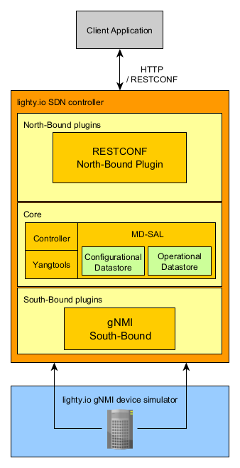

# lighty.io gNMI/RESTCONF use-case example
This example shows gNMI south-bound interface utilized with RESTCONF north-bound interface to manage gNMI devices on the
network. Application works as standalone SDN controller. It is capable to connect to gNMI devices and expose connected
devices over RESTCONF north-bound APIs. In this example the gNMI simulator is started as gNMI target and all operations
are performed on this device.

The application, lighty.io gNMI/RESTCONF is pre-prepared with [Openconfig YANG models](yangs).
These models are used by both gNMI application and gNMI device simulator. Device has already preconfigured state/config
data specified in [initialStateJsonData.json](simulator/initialStateJsonData.json) JSON file.
To communicate with gNMI device it is required to use TLS communication with certificates and username and password
authorization.

This application starts:
* [Lighty.io Controller](../../lighty-core/lighty-controller) with modules:
  * [lighty.io RESTCONF module](../../lighty-modules/lighty-restconf-nb-community)
  * [lighty.io gNMI module](../../lighty-modules/lighty-gnmi/lighty-gnmi-sb)
* [lighty.io gNMI device simulator](../../lighty-modules/lighty-gnmi/lighty-gnmi-device-simulator)



## Prerequisites
In order to build and start and run this example, the lighty.io gNMI/RESTCONF application locally, you need:
* Java 17 or later
* Maven 3.8.5 or later
* Postman v7.36.5. or later
* Linux-based system with bash

## How to run use-case
This example shows how to start [RCgNMI](../../lighty-applications/lighty-rcgnmi-app-aggregator/lighty-rcgnmi-app)
application and [gNMI simulator](../../lighty-modules/lighty-gnmi/lighty-gnmi-device-simulator) app.
Next step describes how to perform basic CRUD operations on the gNMI device using RCgNMI app. All RESTCONF requests used
in this example are provided in [postman-collection](lighty.io gNMI-RESTCONF application.postman_collection.json).

Clone lighty repository and build it with maven. Then move to lighty-gnmi-community-restconf-app folder.
```
git clone git@github.com:PANTHEONtech/lighty.git
cd lighty
mvn clean install
cd lighty-examples/lighty-gnmi-community-restconf-app
```

### Start RCgNMI controller app
Unzip lighty-rcgnmi-app to current location
```
unzip ../../lighty-applications/lighty-rcgnmi-app-aggregator/lighty-rcgnmi-app/target/lighty-rcgnmi-app-19.1.0-SNAPSHOT-bin.zip
```
Start application with pre-prepared configuration [example_config.json](example_config.json).
```
java -jar lighty-rcgnmi-app-19.1.0-SNAPSHOT/lighty-rcgnmi-app-19.1.0-SNAPSHOT.jar -c example_config.json
```

### Start lighty.io gNMI device simulator
Unzip gNMI simulator app to current folder.
```
unzip ../../lighty-modules/lighty-gnmi/lighty-gnmi-device-simulator/target/lighty-gnmi-device-simulator-19.1.0-SNAPSHOT-bin.zip
```

Start the application with pre-prepared configuration [simulator_config.json](simulator/simulator_config.json)
```
java -jar lighty-gnmi-device-simulator-19.1.0-SNAPSHOT/lighty-gnmi-device-simulator-19.1.0-SNAPSHOT.jar  -c simulator/simulator_config.json 
```

### Add client certificates to lighty.io gNMI keystore
Certificates used in this example can be found [here](certificates). Only the client certificates are added
to keystore with RPC. This RPC stores certificates in configuration data-store and encrypt their private key and passphrase.
Adding required certificates for gNMI device to lighty.io gNMI application is performed by postman request `'Add Keystore'`.
```
curl --request POST 'http://127.0.0.1:8888/restconf/operations/gnmi-certificate-storage:add-keystore-certificate' \
--header 'Content-Type: application/json' \
--data-raw "{
    \"input\": {
        \"keystore-id\": \"keystore-id-1\",
        \"ca-certificate\": \"$(cat certificates/ca.crt)\",
        \"client-key\": \"$(cat certificates/client.key)\",
        \"client-cert\": \"$(cat certificates/client.crt)\"
    }
}"
```


### Connect simulator to controller
Simulated gNMI device can be connected with `'Connect device'` request located in postman collection.
```
curl --request PUT 'http://127.0.0.1:8888/restconf/data/network-topology:network-topology/topology=gnmi-topology/node=gnmi-simulator' \
--header 'Content-Type: application/json' \
--data-raw '{
    "node": [
        {
            "node-id": "gnmi-simulator",
            "connection-parameters": {
                "host": "127.0.0.1",
                "port": 10161,
                "keystore-id": "keystore-id-1",
                "credentials": {
                    "username": "admin",
                    "password": "admin"
                }
            },
            "extensions-parameters": {
                "gnmi-parameters": {
                    "use-model-name-prefix": true
                }
            }
        }
    ]
}'
```
The body of this request contains: the identifier for keystore, device information, extension parameters and basic
authorization required by device. When device is successfully connected to application, logs similar to these should be
visible on standard output:
```
 INFO [gnmi_executor-1] (GnmiMountPointRegistrator.java:52) - Mount point for node gnmi-simulator created: {closed=false, instance=org.opendaylight.mdsal.dom.spi.SimpleDOMMountPoint@60112bc5}
 INFO [gnmi_executor-0] (GnmiNodeListener.java:105) - Connection with node Uri{_value=gnmi-simulator} established successfully
```

Device state can be also checked by request `'Get gnmi-simulator node'`. In the section `gnmi-topology:node-state`
of response, current state of device or information about occurred errors can be found. If the device is connected, then
the `node-status` property will contain the value `READY`, in the response.

### Read configuration from device
Provided postman-collection contains few examples for getting data from gNMI device: `'Get interfaces'`,`'Get system'`
and `'Get Authentication'`. 
The `'Get*'` requests show how to obtain information from controller, e.g. to get authentication information:
```
curl --request GET 'http://127.0.0.1:8888/restconf/data/network-topology:network-topology/topology=gnmi-topology/node=gnmi-simulator/yang-ext:mount/openconfig-system:system/aaa/authentication'
```

### Write configuration to device
To write authentication information the PUT request `'Put Authentication config/state'` from postman collection can be
used.
```
curl --request PUT 'http://127.0.0.1:8888/restconf/data/network-topology:network-topology/topology=gnmi-topology/node=gnmi-simulator/yang-ext:mount/openconfig-system:system/aaa/authentication' \
--header 'Content-Type: application/json' \
--data-raw '{
    "openconfig-system:authentication": {
        "config": {
            "authentication-method": [
                "openconfig-aaa-types:TACACS_ALL"
            ]
        },
        "state": {
            "authentication-method": [
                "openconfig-aaa-types:RADIUS_ALL"
            ]
        }
    }
}'
```
This request replace data in `authentication/config` container, remove the `admin-user` container and add new container
`state`. All request setting the specific information on gNMI simulator are applying into CONFIGURATION datastore.
To view and check changed configuration, the `'Get Authentication from CONFIG'` request is located in postman collection.
```
curl --request GET 'http://127.0.0.1:8888/restconf/data/network-topology:network-topology/topology=gnmi-topology/node=gnmi-simulator/yang-ext:mount/openconfig-system:system/aaa/authentication?content=config'
```
To view actual running configuration of device, it is required to sent request with `?content=nonconfig` parameter
at the end of the URL or execute request from postman collection `'Get Authentication from STATE'`.
```
curl --request GET 'http://127.0.0.1:8888/restconf/data/network-topology:network-topology/topology=gnmi-topology/node=gnmi-simulator/yang-ext:mount/openconfig-system:system/aaa/authentication?content=nonconfig'
```

### Update configuration on device
To update data, the example request `'Update config data'` can be used. This request append new type to config
authentication-method.
```
curl --request PATCH 'http://127.0.0.1:8888/restconf/data/network-topology:network-topology/topology=gnmi-topology/node=gnmi-simulator/yang-ext:mount/openconfig-system:system/aaa/authentication/config' \
--header 'Content-Type: application/json' \
--data-raw '{
    "openconfig-system:config": {
        "authentication-method": [
            "openconfig-aaa-types:RADIUS_ALL"
        ]
    }
}'
```
To validate request send GET request `'Get Authentication from CONFIG'`.
```
curl --request GET 'http://127.0.0.1:8888/restconf/data/network-topology:network-topology/topology=gnmi-topology/node=gnmi-simulator/yang-ext:mount/openconfig-system:system/aaa/authentication?content=config'
```

### Delete configuration from device
For deleting `config` container send request `'Delete authentication config'`.
```
curl --location --request DELETE 'http://127.0.0.1:8888/restconf/data/network-topology:network-topology/topology=gnmi-topology/node=gnmi-simulator/yang-ext:mount/openconfig-system:system/aaa/authentication/config'
```
To validate request send GET request `'Get Authentication from CONFIG'`.
```
curl --request GET 'http://127.0.0.1:8888/restconf/data/network-topology:network-topology/topology=gnmi-topology/node=gnmi-simulator/yang-ext:mount/openconfig-system:system/aaa/authentication?content=config'
```

### Disconnect the device from controller
When is required restart of connection or removal of device, just send request `'Remove device'`.
```
curl --request DELETE 'http://127.0.0.1:8888/restconf/data/network-topology:network-topology/topology=gnmi-topology/node=gnmi-simulator'
```
For restarting connection it is required to send request `'Connect device'`
